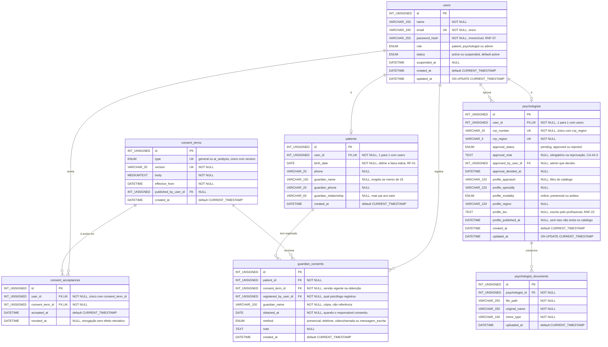
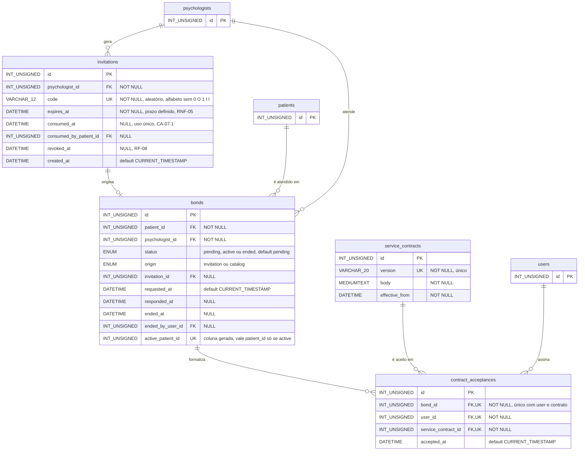

# DER — Diagrama Entidade-Relacionamento

**Calmind** — Saúde Mental & Acolhimento
TCC · Técnico em Desenvolvimento de Sistemas · SENAI-SP · 4º termo · 2026

> Este é o **modelo lógico**: a evolução do [MER conceitual](modelo-de-dados.md#2-mer-modelo-entidade-relacionamento),
> já com atributos, chaves primárias, chaves estrangeiras, chaves únicas e tipos de dados.
>
> O modelo é grande demais para caber legível num diagrama só, então está dividido em **quatro
> domínios**. O grafo completo de relacionamentos, com todas as 25 entidades numa figura única,
> está no MER. A versão executável em DDL está em [`schema.sql`](schema.sql), e é ela a fonte de
> verdade: **onde este diagrama divergir do `schema.sql`, o `schema.sql` vence.**

---

## Como ler

| Marca | Significado |
|---|---|
| `PK` | Chave primária |
| `FK` | Chave estrangeira |
| `UK` | Chave única (restrição de unicidade, não é a PK) |
| `||--o{` | Um para muitos, com zero permitido do lado muitos |
| `||--o|` | Um para zero ou um |

Caixa que aparece sem atributos num domínio está detalhada no domínio onde nasce. Todas as
tabelas usam InnoDB, `utf8mb4` e `utf8mb4_unicode_ci`. Todo `id` é `INT UNSIGNED AUTO_INCREMENT`.

---

## 1. Identidade, papéis e consentimento

Cobre RF-01 a RF-05, RF-33, RF-44, RF-45, RF-46, RF-49 e RNF-11.



**Restrições que o diagrama não mostra e o banco impõe:**

- `ck_patients_guardian` — os três campos do responsável (`guardian_name`, `guardian_phone`,
  `guardian_relationship`) estão **todos preenchidos ou todos vazios**. Contato pela metade não
  serve ao psicólogo (CA-36.5).
- A idade mínima de 12 anos **não** é `CHECK`: a regra depende da data de hoje e `CHECK` no MariaDB
  só aceita expressão determinística. A verificação vive na aplicação (CA-01.4, CA-01.5).
- `uq_terms_type_version` — versão publicada de um termo não se edita, se cria outra (CA-46.2).
- `guardian_consents` é *append-only*: CA-49.3 proíbe editar registro existente.

---

## 2. Convite, vínculo e contrato

Cobre RF-06 a RF-14, RF-48, RNF-05, RNF-06 e RNF-24.



**A coluna que carrega a regra mais importante do modelo.** `bonds.active_patient_id` é
`INT UNSIGNED AS (IF(status = 'active', patient_id, NULL)) PERSISTENT`, com índice único
`uq_one_active_bond_per_patient`. Ela vale o id do paciente **somente** quando o vínculo está ativo;
fora disso vale `NULL`, e `NULL` não colide em índice único. Resultado: o banco recusa o segundo
vínculo ativo do mesmo paciente (RF-12, DEC-03) mesmo sob duas requisições simultâneas — a regra não
depende de nenhuma linha de PHP.

---

## 3. Ciclo semanal: relato, tarefa, mensagem, consulta e medicação

Cobre RF-15, RF-22 a RF-29, RF-37 a RF-40 e RNF-08.

```mermaid
erDiagram
    bonds ||--o{ reports : recebe
    bonds ||--o{ tasks : contém
    bonds ||--o{ messages : contém
    bonds ||--o{ appointments : agenda
    bonds ||--o{ medications : registra
    patients ||--o{ reports : escreve
    users ||--o{ tasks : cria
    users ||--o{ messages : envia
    users ||--o{ appointments : cria
    medications ||--o{ medication_schedules : "tem horário"
    medications ||--o{ medication_intakes : "tem tomada"

    reports {
        INT_UNSIGNED id PK
        INT_UNSIGNED bond_id FK "NOT NULL"
        INT_UNSIGNED patient_id FK "NOT NULL"
        MEDIUMTEXT body "NOT NULL"
        ENUM visibility "shared ou private, default shared, DEC-13"
        DATETIME unpublished_at "NULL, despublicado pelo paciente, RF-24"
        DATETIME created_at "default CURRENT_TIMESTAMP"
    }

    tasks {
        INT_UNSIGNED id PK
        INT_UNSIGNED bond_id FK "NOT NULL"
        VARCHAR_150 title "NOT NULL"
        TEXT description "NULL"
        DATE due_date "NOT NULL, não pode ser no passado, CA-37.3"
        INT_UNSIGNED created_by_user_id FK "NOT NULL"
        DATETIME completed_at "NULL, não duplica conclusão, CA-25.3"
        DATETIME archived_at "NULL, arquiva em vez de excluir, CA-37.4"
        DATETIME created_at "default CURRENT_TIMESTAMP"
    }

    messages {
        INT_UNSIGNED id PK
        INT_UNSIGNED bond_id FK "NOT NULL"
        INT_UNSIGNED sender_user_id FK "NOT NULL"
        TEXT body "NOT NULL"
        DATETIME sent_at "default CURRENT_TIMESTAMP"
        DATETIME read_at "NULL"
    }

    appointments {
        INT_UNSIGNED id PK
        INT_UNSIGNED bond_id FK "NOT NULL"
        DATETIME scheduled_at "NOT NULL"
        ENUM status "scheduled, rescheduled, cancelled ou done"
        ENUM modality "online ou presencial, NULL"
        VARCHAR_255 notes "NULL"
        INT_UNSIGNED created_by_user_id FK "NOT NULL"
        DATETIME created_at "default CURRENT_TIMESTAMP"
        DATETIME updated_at "ON UPDATE CURRENT_TIMESTAMP"
    }

    medications {
        INT_UNSIGNED id PK
        INT_UNSIGNED bond_id FK "NOT NULL"
        VARCHAR_150 name "NOT NULL"
        VARCHAR_100 dosage "NULL"
        VARCHAR_200 prescription_source "NOT NULL, quem prescreveu, CA-38.2"
        ENUM status "awaiting_confirmation, active, refused ou suspended"
        INT_UNSIGNED registered_by_user_id FK "NOT NULL"
        DATETIME confirmed_at "NULL, confirmação do paciente"
        DATETIME refused_at "NULL"
        TEXT refusal_reason "NULL, obrigatório na recusa, CA-27.4"
        DATETIME suspended_at "NULL"
        INT_UNSIGNED suspended_by_user_id FK "NULL, de quem partiu, CA-29.2"
        DATETIME created_at "default CURRENT_TIMESTAMP"
    }

    medication_schedules {
        INT_UNSIGNED id PK
        INT_UNSIGNED medication_id FK,UK "NOT NULL, único com dia e hora"
        TINYINT_UNSIGNED weekday UK "0 domingo a 6 sábado"
        TIME time_of_day UK "NOT NULL"
    }

    medication_intakes {
        INT_UNSIGNED id PK
        INT_UNSIGNED medication_id FK,UK "NOT NULL, único com scheduled_for"
        DATETIME scheduled_for UK "NOT NULL"
        DATETIME marked_at "default CURRENT_TIMESTAMP"
    }

    bonds {
        INT_UNSIGNED id PK
    }
    patients {
        INT_UNSIGNED id PK
    }
    users {
        INT_UNSIGNED id PK
    }
```



### 3.1 A view que isola o relato privado

O relato privado não é isolado por uma coluna apenas: existe uma **view** e é ela, e nunca a tabela
`reports`, que toda consulta do lado do psicólogo e toda rotina de envio à IA leem.

```sql
CREATE VIEW shared_reports AS
  SELECT id, bond_id, patient_id, body, created_at
    FROM reports
   WHERE visibility = 'shared'
     AND unpublished_at IS NULL;
```

O relato privado não aparece **nem no conteúdo, nem na contagem** (RNF-08, DEC-14). Despublicar
continua sendo um `UPDATE` de uma coluna. O que isso exige em troca, e sem o quê a garantia não
existe: um teste automatizado que verifique que nenhuma consulta do perfil psicólogo referencia a
tabela `reports` diretamente.

**Ausência de linha em `medication_intakes` significa não marcado.** O sistema nunca presume a
tomada (CA-28.4).

---

## 4. Análise por IA, auditoria, denúncia e notificação

Cobre RF-16, RF-17, RF-18, RF-41, RF-42, RF-45 e RNF-30 a RNF-33.

```mermaid
erDiagram
    bonds ||--o{ analyses : resume
    users ||--o{ analyses : solicita
    analyses ||--o{ analysis_reports : considera
    reports ||--o{ analysis_reports : "é considerado em"
    analyses ||--o{ analysis_versions : versiona
    users ||--o{ analysis_versions : edita
    users ||--o{ audit_logs : origina
    patients ||--o{ audit_logs : "é alvo de"
    users ||--o{ complaints : denuncia
    users ||--o{ notifications : recebe
    users ||--o{ notification_preferences : configura

    analyses {
        INT_UNSIGNED id PK
        INT_UNSIGNED bond_id FK "NOT NULL"
        INT_UNSIGNED requested_by_user_id FK "NOT NULL, sempre humano, RNF-30"
        DATE period_start "NOT NULL"
        DATE period_end "NOT NULL"
        ENUM status "generated, confirmed ou discarded"
        MEDIUMTEXT summary_raw "NULL, apagado no descarte, CA-42.2"
        DATETIME requested_at "default CURRENT_TIMESTAMP"
        DATETIME confirmed_at "NULL"
    }

    analysis_reports {
        INT_UNSIGNED analysis_id PK,FK "chave primária composta"
        INT_UNSIGNED report_id PK,FK "chave primária composta"
    }

    analysis_versions {
        INT_UNSIGNED id PK
        INT_UNSIGNED analysis_id FK "NOT NULL"
        MEDIUMTEXT body "NOT NULL"
        INT_UNSIGNED edited_by_user_id FK "NOT NULL"
        DATETIME edited_at "default CURRENT_TIMESTAMP"
    }

    audit_logs {
        INT_UNSIGNED id PK
        INT_UNSIGNED actor_user_id FK "NULL, ON DELETE SET NULL"
        VARCHAR_60 action "NOT NULL"
        VARCHAR_60 resource_type "NOT NULL"
        INT_UNSIGNED resource_id "NULL"
        INT_UNSIGNED target_patient_id FK "NULL"
        ENUM result "allowed ou denied, tentativa negada também entra"
        DATETIME occurred_at "default CURRENT_TIMESTAMP"
    }

    complaints {
        INT_UNSIGNED id PK
        INT_UNSIGNED reporter_user_id FK "NOT NULL"
        INT_UNSIGNED reported_user_id FK "NOT NULL"
        VARCHAR_120 reason "NOT NULL, motivo obrigatório, CA-18.2"
        TEXT description "NULL"
        ENUM status "open, closed ou reopened, default open"
        TEXT decision "NULL"
        INT_UNSIGNED decided_by_user_id FK "NULL"
        DATETIME decided_at "NULL"
        DATETIME created_at "default CURRENT_TIMESTAMP"
    }

    notifications {
        INT_UNSIGNED id PK
        INT_UNSIGNED user_id FK "NOT NULL"
        VARCHAR_60 type "NOT NULL, o tipo do evento, nunca conteúdo clínico"
        INT_UNSIGNED resource_id "NULL"
        DATETIME created_at "default CURRENT_TIMESTAMP"
        DATETIME read_at "NULL"
    }

    notification_preferences {
        INT_UNSIGNED user_id PK,FK "chave primária composta"
        VARCHAR_60 type PK "chave primária composta"
        TINYINT enabled "default 1, CA-16.2"
    }

    bonds {
        INT_UNSIGNED id PK
    }
    reports {
        INT_UNSIGNED id PK
    }
    patients {
        INT_UNSIGNED id PK
    }
    users {
        INT_UNSIGNED id PK
    }
```



**Duas garantias que vivem aqui:**

- `audit_logs` é **somente inserção**. A aplicação nunca altera nem apaga linha (CA-17.3), e a
  tentativa negada entra no log junto com a permitida (CA-05.2, CA-23.5).
- A sugestão da IA **não persiste antes da confirmação**: a linha em `analyses` sempre existe, com
  quem pediu e quando, mas o texto vive em `summary_raw`, que é **apagado** quando o psicólogo
  descarta. Fica o rastro do acionamento, some o conteúdo. O texto confirmado vai para
  `analysis_versions`, que guarda cada edição posterior (CA-42.4).

---

## 5. Convenções de tipo

| Tipo no diagrama | Tipo real no `schema.sql` | Uso |
|---|---|---|
| `INT_UNSIGNED` | `INT UNSIGNED` | Toda chave primária e estrangeira |
| `VARCHAR_n` | `VARCHAR(n)` | Texto curto de tamanho conhecido |
| `TEXT` | `TEXT` | Texto médio: descrição, justificativa, observação |
| `MEDIUMTEXT` | `MEDIUMTEXT` | Corpo de relato, termo de consentimento, resumo da IA |
| `ENUM` | `ENUM(...)` | Domínio fechado; os valores estão no comentário do atributo |
| `DATE` | `DATE` | Data sem hora: nascimento, prazo, período |
| `DATETIME` | `DATETIME` | Data com hora; todo carimbo de tempo |
| `TIME` | `TIME` | Hora do dia, sem data |
| `TINYINT` | `TINYINT(1)` | Booleano |
| `TINYINT_UNSIGNED` | `TINYINT UNSIGNED` | Dia da semana, 0 a 6 |

O sublinhado substitui o parêntese porque o Mermaid não aceita parêntese em tipo de atributo. O
tipo exato, com tamanho, está em [`schema.sql`](schema.sql).

---

## 6. Como executar e provar este modelo

O DER não foi só desenhado, foi executado:

```bash
mysql -u root -e "CREATE DATABASE tcc_schema_test"
mysql -u root tcc_schema_test < docs/diagramas/schema.sql
mysql -u root --force --table tcc_schema_test < docs/diagramas/testes-do-modelo.sql
```

São quatro provas, e elas verificam que **o banco, e não o código da aplicação**, garante o vínculo
ativo único por paciente e o isolamento do relato privado. O resultado esperado de cada uma e a
leitura dos números estão na [seção 6 do modelo de dados](modelo-de-dados.md#6-verificação-o-modelo-foi-executado-não-só-desenhado).
