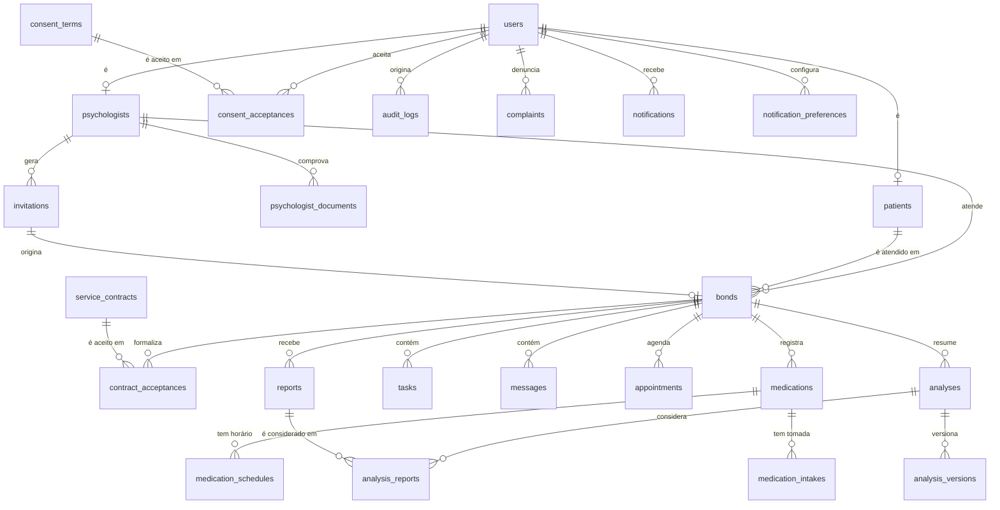
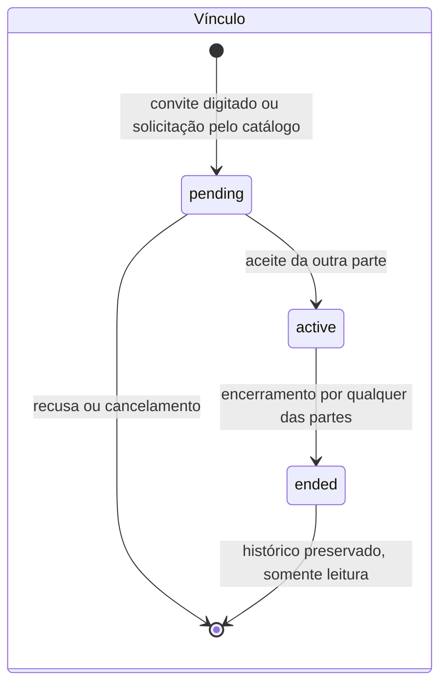
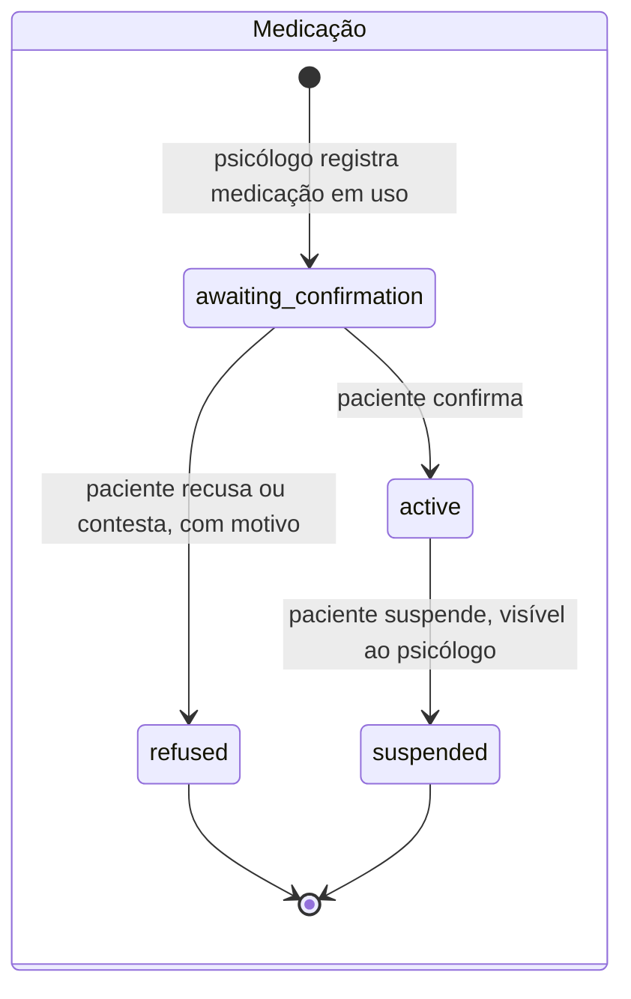

# Modelo de dados

**TCC · Técnico em Desenvolvimento de Sistemas · SENAI-SP · 4º termo**
**Calmind** — Saúde Mental & Acolhimento
Sprint 1, entregável de diagramação. Revisão de 19/08/2026.

> **Rascunho para revisão de Rafael e Zanetti.** O modelo abaixo cobre todos os requisitos Must do `documento-requisitos.md`. Cada decisão de modelagem está justificada na seção 4, e o DDL executável está em `schema.sql`, testado contra o MariaDB da máquina do grupo.

---

## 1. Decisões que este modelo assume

| # | Decisão | Origem |
|---|---------|--------|
| 1 | Uma entidade `users` com papel, e as entidades `patients` e `psychologists` penduradas nela | DP-02 |
| 2 | Banco relacional MySQL, compatível com o MariaDB 10.4 do XAMPP do grupo | DP-03 |
| 3 | Idioma dos identificadores: **inglês** em tabela, coluna e campo de API. Português apenas no texto que o usuário lê | DP-14 |
| 4 | Isolamento do relato privado por coluna de visibilidade **mais uma view exclusiva** para o lado do psicólogo | DP-06, ver seção 4.2 |

**Se o grupo discordar da decisão 3, é agora.** Depois que as migrations existirem, renomear coluna custa caro.

---

## 2. MER, modelo entidade relacionamento



### 2.1 Cardinalidades que carregam regra de negócio

| Relação | Cardinalidade | Requisito |
|---------|---------------|-----------|
| `patients` para `bonds` com status ativo | **1 para no máximo 1** | RF-12, DEC-03 |
| `psychologists` para `bonds` com status ativo | 1 para N, sem teto | RF-12, CA-12.3 |
| `users` para `patients` e `psychologists` | 1 para 0 ou 1, e nunca os dois ao mesmo tempo | DP-02, RF-05 |
| `invitations` para `bonds` | 1 para 0 ou 1, porque o convite é de uso único | RF-07, RNF-05 |
| `reports` para `analysis_reports` | N para N com `analyses` | CA-24.2 |

---

## 3. Diagrama de estados

Os dois ciclos de vida que o RNF-50 exige serem atômicos.





**Nenhum lembrete dispara fora do estado `active`** (CA-28.3). E `suspended` não volta para `active`: o psicólogo precisa criar um novo registro, sujeito a nova confirmação (CA-39.3).

---

## 4. As três decisões de modelagem que precisam de justificativa

### 4.1 Vínculo ativo único, garantido pelo banco

O RF-12 diz que um paciente tem no máximo um vínculo ativo. Verificar isso só no código deixa a porta aberta para duas requisições simultâneas criarem dois vínculos, que é exatamente o caso que o CA-12.2 e o critério de verificação do RNF-50 mandam testar.

A solução no schema é uma coluna gerada:

```sql
active_patient_id INT GENERATED ALWAYS AS (IF(status = 'active', patient_id, NULL)) PERSISTENT,
UNIQUE KEY uq_one_active_bond (active_patient_id)
```

Quando o vínculo está ativo, a coluna vale o id do paciente e o índice único impede o segundo. Quando não está, vale `NULL`, e `NULL` não colide em índice único. **A regra deixa de depender de disciplina do programador.**

### 4.2 Relato privado: revisão da recomendação da DP-06

Numa versão anterior do planejamento eu recomendei separar os relatos privados em tabela própria. **Mudei de recomendação, e vale explicar por quê**, porque a decisão contrária também é defensável.

O problema apareceu no RF-24: o paciente pode despublicar um relato já compartilhado. Com duas tabelas, despublicar vira mover linha de uma tabela para outra, o que quebra as chaves estrangeiras que apontam para aquele relato, em especial a de `analysis_reports`, que o CA-24.2 precisa manter para avisar que o relato já foi usado em análise.

A alternativa que mantém a garantia na camada de dados sem esse custo:

```sql
CREATE VIEW shared_reports AS
  SELECT ... FROM reports WHERE visibility = 'shared';
```

Toda consulta do lado do psicólogo lê `shared_reports` e **nunca** lê `reports`. A rotina que monta o pacote enviado à IA também. O relato privado continua invisível, a regra continua vivendo no banco e não na tela, e despublicar volta a ser um `UPDATE` de uma coluna.

**O que isso exige em troca**, e sem isso a garantia não existe: o teste automatizado do RNF-08 precisa verificar que nenhuma consulta do perfil psicólogo referencia a tabela `reports` diretamente. É uma verificação de código, não de dado, e precisa entrar na suíte da semana 4.

### 4.3 Sugestão de IA que não persiste antes da confirmação

O DEC-05 e o CA-42.2 dizem que uma análise descartada não pode ficar disponível em nenhuma consulta posterior. O RNF-33, por outro lado, exige registro de cada acionamento do serviço de IA, com autor, data e relatos considerados.

Os dois convivem assim: a linha em `analyses` sempre existe, com quem pediu e quando, mas o texto vive em `summary_raw`, que é **apagado** quando o psicólogo descarta. Fica o rastro do acionamento, some o conteúdo. O texto confirmado vai para `analysis_versions`, que guarda cada edição posterior, atendendo o CA-42.4.

---

## 5. Rastreabilidade: onde cada requisito Must mora

| Tabela | Requisitos atendidos |
|--------|----------------------|
| `users` | RF-01, RF-02, RF-05, RF-45 |
| `patients`, `psychologists` | RF-01, RF-33, RF-34, RF-44 |
| `psychologist_documents` | RF-33, RNF-11 |
| `consent_terms`, `consent_acceptances` | RF-03, RF-04, RF-46, RNF-13 |
| `invitations` | RF-06, RF-07, RF-08, RNF-05, RNF-06 |
| `bonds` | RF-10 a RF-14, DEC-02, DEC-03 |
| `service_contracts`, `contract_acceptances` | RF-48, RNF-24 |
| `reports` mais a view `shared_reports` | RF-22, RF-23, RF-24, RNF-08 |
| `tasks` | RF-25, RF-37 |
| `messages` | RF-15 |
| `appointments` | RF-26, RF-40 |
| `medications`, `medication_schedules`, `medication_intakes` | RF-27, RF-28, RF-29, RF-38, RF-39 |
| `analyses`, `analysis_reports`, `analysis_versions` | RF-41, RF-42, RNF-30 a RNF-33 |
| `audit_logs` | RF-17, RNF-04 |
| `complaints` | RF-18, RF-45 |
| `notifications`, `notification_preferences` | RF-16 |

Requisitos Must que **não** aparecem no modelo, porque são regra de aplicação e não de dado: RF-09 (o catálogo é uma consulta sobre `psychologists` com perfil publicado), RF-35, RF-36 (consultas consolidadas) e RF-43 (aviso na interface).

---

## 6. Verificação: o modelo foi executado, não só desenhado

O `schema.sql` roda no MariaDB 10.4 do XAMPP2 desta máquina. Em 19/08/2026 ele criou **24 tabelas e 1 view** sem erro, e as quatro provas de `testes-do-modelo.sql` passaram:

```
ERROR 1062 (23000): Duplicate entry '1' for key 'uq_one_active_bond_per_patient'
ERROR 1062 (23000): Duplicate entry 'K7M9PQ' for key 'uq_invitation_code'

| PROVA 1b OK: o banco recusou o segundo vinculo ativo       |
| PROVA 2 OK: apos encerrar, o novo vinculo ativo foi aceito |
| total_real | visivel_ao_psicologo | veredito               |
|          4 |                    2 | OK: psicologo ve 2 de 4 |
| OK: nenhuma linha privada na view                          |
| PROVA 4b OK: o banco recusou o codigo repetido             |
```

Os dois `ERROR 1062` **são o resultado esperado**, não falha: são o banco recusando o segundo vínculo ativo do mesmo paciente e o código de convite repetido. Cada prova confere o estado final da tabela em vez de confiar na ordem das linhas, então o veredito diz a verdade mesmo rodando com `--force`.

A prova 3 é a que vale mostrar para a banca: com 4 relatos gravados, sendo 1 privado e 1 despublicado, a consulta do lado do psicólogo devolve 2. O relato privado não aparece nem no conteúdo nem na contagem, e isso não depende de nenhuma linha de PHP.

**Como reproduzir:**

```bash
mysql -u root -e "CREATE DATABASE tcc_schema_test"
mysql -u root tcc_schema_test < docs/diagramas/schema.sql
mysql -u root --force --table tcc_schema_test < docs/diagramas/testes-do-modelo.sql
```

---

## 7. O que falta neste modelo

Registrado para não passar por pronto o que não está:

1. **Dados clínicos do paciente** estão mínimos. O documento base não define quais dados de perfil o paciente informa além de identificação, então só entrou o essencial. Se o grupo quiser data de nascimento, telefone ou contato de emergência, entra em `patients`.
2. **Anexo em relato ou mensagem** não existe. Não há requisito pedindo, e acrescentar depois é barato.
3. **Índices de desempenho** estão só nos caminhos óbvios: chaves estrangeiras, código de convite e as consultas por vínculo e por período. O RNF-41 e o RNF-43 vão dizer se falta algum, e isso só se descobre medindo, na semana 11.
4. **Soft delete** não foi adotado em lugar nenhum. O RF-14 exige preservar histórico, e o modelo faz isso por estado (`ended`), não por exclusão lógica.
